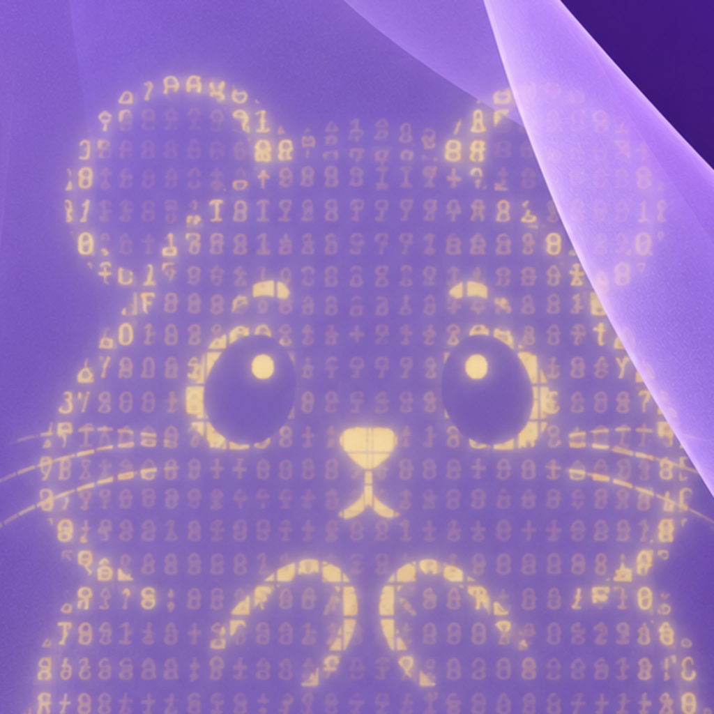
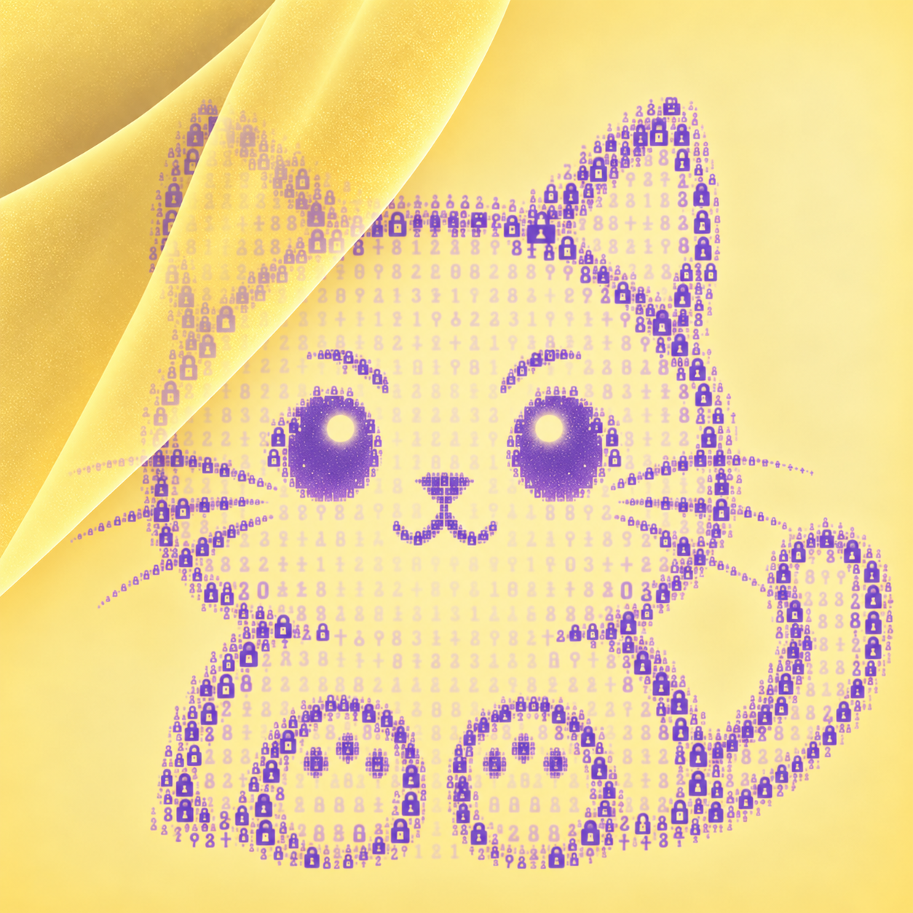

# UnVeilmi

[中文](README_zh-TW.md)

> **Hide the Veilmi ciphertext somewhere else.  
> Let the everyday conversation carry only the clue.**

<p align="center">
  <a href="https://github.com/noa-jou/Veilmi">
    
  </a>
</p>

> **Veilmi handles encryption and decryption.  
> UnVeilmi handles Veilmi ciphertext storage.**

<p align="center">
  
</p>

UnVeilmi is a Proof of Concept for a different kind of encrypted communication workflow.

If you paste a long encrypted message directly into LINE, a workplace chat, or another everyday communication tool, the visible conversation immediately looks like people are exchanging ciphertext.

UnVeilmi separates those two things.

The everyday chat carries only a short **Article Name**—or, you could say, the clue.

```text
Visible everyday conversation
"did you get home"
        ↓
Article Name (clue)
        ↓
UnVeilmi (Find) retrieves the ciphertext
        ↓
Veilmi (Decrypt) decrypts it
        ↓
The real message
```

UnVeilmi stores and retrieves the ciphertext.

Veilmi encrypts and decrypts it locally.

The goal is to make encrypted communication less visually obvious by not placing the ciphertext itself inside the "normal" conversation channel.

---

## Demo

https://github.com/user-attachments/assets/915d369c-38eb-4753-a362-70306c49f0ac

The demo follows a LINE conversation between **Noa** and **Kate**.

At first, it looks completely ordinary:

```text
Noa: did you get home
Kate: yeah just got back
```

But each visible message is also an UnVeilmi **Article Name**.

In the video:

```text
did you get home
```

is searched for in UnVeilmi.

UnVeilmi returns a ciphertext.

That ciphertext is copied into Veilmi and decrypted with the shared demo passphrase.

The hidden message is:

```text
I (Noa) won the lottery!
```

The next visible LINE message:

```text
yeah just got back
```

reveals Kate's reply:

```text
Wait. Seriously? How much did you win?
```

And then the demo stops.

The rest of the conversation is an Easter Egg.

Want to continue the story yourself?

See:

[Easter Egg Guide](docs/Easter_Egg_Guide.md)

---

## Why Veilmi Matters

UnVeilmi does not encrypt or decrypt messages.

That is intentional.

**Veilmi** remains the tool that handles the secret locally.

```text
Plaintext + passphrase
        ↓
      Veilmi
        ↓
   VEILMI1 ciphertext
        ↓
     UnVeilmi
```

The UnVeilmi server does not need the plaintext or Veilmi passphrase.

This is one of the most important design boundaries in the project.

If you want to try the demo or use the workflow yourself, start with [Get Veilmi](https://noa-jou.github.io/Veilmi/closed-testing.html).

---

## How It Works

### Publish

```text
Write plaintext in Veilmi
        ↓
Encrypt locally
        ↓
Copy VEILMI1 ciphertext
        ↓
Open UnVeilmi
        ↓
Choose Article Name
        ↓
Choose storage duration
        ↓
Publish
```

### Find

```text
Receive Article Name
        ↓
Open UnVeilmi
        ↓
Retrieve ciphertext
        ↓
Copy ciphertext
        ↓
Open Veilmi
        ↓
Enter the shared passphrase
        ↓
Decrypt locally
```

The Article Name is only a locator / a clue.

It is not a password and should not be treated as a secret.

---

## The Bigger Idea

UnVeilmi is currently a local Proof of Concept.

But the idea is intentionally broader.

A future public UnVeilmi service could allow people who need this communication pattern to use it without running their own server.

A team or organization could also adapt the project and deploy its own version on infrastructure it controls.

For example, an internal deployment could look like:

```text
Existing workplace chat
        ↓
Send a short Article Name (clue)

--

Organization-operated UnVeilmi
        ↓
Temporarily store ciphertext so intended users can retrieve it

--

Veilmi on each user's device
        ↓
Decrypt locally
```

> Sorry, but the US$99 annual Apple Developer Program fee is still a little too expensive for me right now, so there is no iOS version yet.  
> [Veilmi](https://github.com/noa-jou/Veilmi) is built with Flutter and is open source. If you are interested, you are very welcome to fork the project and try bringing it to iOS or other platforms.

---

## Why UnVeilmi Matters

This approach may be useful when people need to exchange legitimate sensitive text while keeping the visible conversation channel simple and ordinary.

For example:

- an internal team discussing a private draft;
- a small organization separating sensitive notes from normal chat history;
- a research group testing privacy-preserving communication workflows;
- an organization that wants to control its own ciphertext storage by operating its own environment.

UnVeilmi is not currently a production service. Any real deployment would still need proper infrastructure, policy, security, and legal review.

But the PoC is meant to show that the communication model itself can work.

---

## Self-Hosting Vision

UnVeilmi is designed to be modified and extended.

A developer, small team, or organization can fork the project and change things such as the hostname, storage rules, retention period, and more.

While keeping the central idea:

```text
Everyday communication channel: carries the locator / clue / Article Name

UnVeilmi: stores the ciphertext

Veilmi: handles the real message
```

A private deployment could run on an organization's own server rather than relying on a public UnVeilmi service.

For production deployment, additional work would still be needed, including HTTPS, rate limiting, monitoring, abuse controls, and infrastructure hardening.

For the reasoning behind the current PoC design choices, see:

[Design Decisions — §7 Why Is the Current PoC Local?](docs/Design_Decisions.md#7-why-is-the-current-poc-local)

UnVeilmi intentionally avoids becoming a full social network or messaging platform.

---

## Current Project Structure

| Part | Current implementation |
|---|---|
| Frontend | HTML / CSS / JavaScript |
| Backend | Python / FastAPI |
| Database | SQLite |
| Environment | Local Debian environment |
| Storage | Temporary ciphertext storage |
| Payment | Simulation only |
| Deployment | Local only |
| Accounts | None |

For the full architecture, see: [Architecture](docs/Architecture.md)

---

## Quick Start

### 1. Create the Database

[Database Setup](docs/Set_Up_DB.md)

### 2. Start the Backend

[Backend Setup](docs/Set_Up_Backend.md)

### 3. Start the Frontend

[Frontend Setup](docs/Set_Up_Frontend.md)

### 4. Run the Tests

[Auto Testing](docs/Auto_Testing.md)

### 5. Try It Yourself Manually

After completing steps 1–4, just open a browser and play with:

[http://127.0.0.1:5500](http://127.0.0.1:5500)

---

## Full Documentation List

| Document | What it explains |
|---|---|
| [Architecture](docs/Architecture.md) | Components, Publish / Find flow, backend, database, trust boundaries, and local environment |
| [Security Model](docs/Security_Model.md) | Threat model, why the separation is safer, validation, CORS, metadata, and limitations |
| [Pricing and Storage](docs/Pricing_and_Storage.md) | Free tier, pricing formula, storage duration, expiry, cleanup, and Article Name reuse |
| [Auto Testing](docs/Auto_Testing.md) | Automated backend and frontend development tests |
| [Database Setup](docs/Set_Up_DB.md) | Create, inspect, and test the SQLite database |
| [Backend Setup](docs/Set_Up_Backend.md) | Install dependencies and run the FastAPI backend |
| [Frontend Setup](docs/Set_Up_Frontend.md) | Run the local web frontend and connect it to the backend |
| [Design Decisions](docs/Design_Decisions.md) | Why the major product and architecture choices were made |
| [Easter Egg Guide](docs/Easter_Egg_Guide.md) | Reproduce the Kate / Noa hidden-message demo |

---

## PoC Limitations

I do not currently provide:

- a public UnVeilmi service;
- production HTTPS deployment;
- authentication;
- rate limiting;
- abuse detection;
- production monitoring;
- real payment processing;
- complete anonymity;
- a professional security audit;
- a cryptographic audit.

The project is meant to demonstrate the architecture and inspire further development, not to claim production readiness.

---

## License

UnVeilmi is licensed under:

**GNU Affero General Public License v3.0 (AGPL-3.0)**

You are welcome to study, modify, and deploy the project.

For network-hosted modifications, AGPL-3.0 is intended to keep improvements available to the open-source community.

See the repository [LICENSE](LICENSE) file for the full license text.

---

## Author

**Noa Jou**

(with the help of ChatGPT)

UnVeilmi is a companion project to [Veilmi](https://github.com/noa-jou/Veilmi).

I hope this project can eventually become more than a local demo, and instead:

- become a public service for people who need this communication pattern;
- become a self-hosted tool that teams can modify and deploy themselves;
- or become an idea that another developer takes further.

If UnVeilmi makes you curious, please take a look at [Veilmi](https://github.com/noa-jou/Veilmi) too.

---

### Things I Unexpectedly Learned While Developing

[GitHub_Actions_Docs_Check_Learning_Note](docs/GitHub_Actions_Docs_Check_Learning_Note.md)

[How_to_Prepare_and_Add_a_Video_to_README](docs/How_to_Prepare_and_Add_a_Video_to_README.md)

---

### If You Want to Support More of My Creation:

[Buy me a coffee](https://buymeacoffee.com/noajou)
