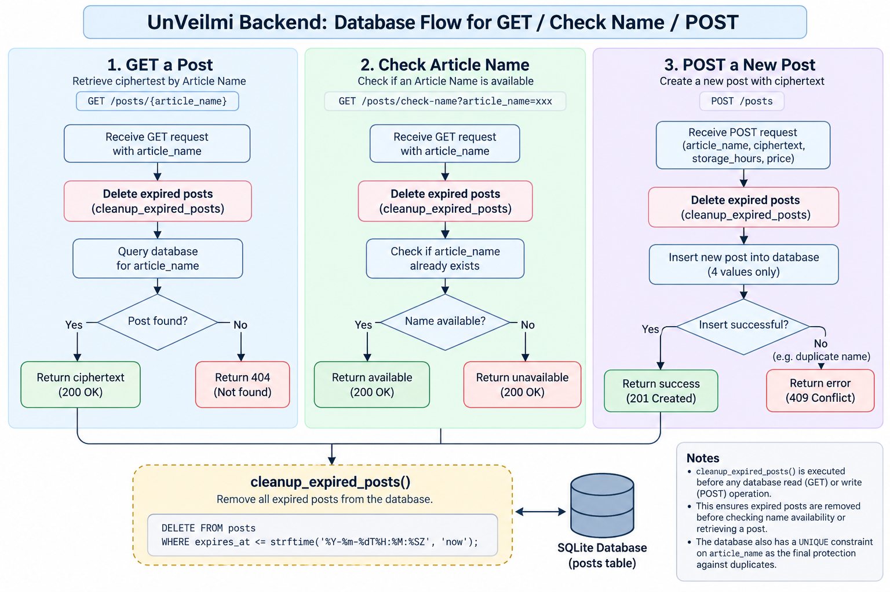

# Pricing and Storage

UnVeilmi is designed for **temporary ciphertext storage**.

The Proof of Concept does not process real payments. It only calculates a demonstration price based on:

1. ciphertext size;
2. requested storage duration.

For the wider system structure, see [Architecture](Architecture.md).

---

## 1. Storage Duration

A post may be stored for:

```text
Minimum: 1 hour
Maximum: 8760 hours (365 days)
```

The requested duration is stored as:

```text
storage_hours
```

The database also keeps:

```text
created_at
expires_at
```

`expires_at` is generated from the creation time and requested storage duration.

---

## 2. Free Tier

A post is free when **both** conditions are true:

```text
ciphertext size <= 1024 bytes
storage duration <= 24 hours
```

In that case:

```text
price = USD 0
```

If either limit is exceeded, the normal pricing formula applies.

---

## 3. Pricing Formula

The Proof of Concept uses:

```text
USD 1 per KB-day
```

Where:

```text
1 KB = 1024 bytes
1 day = 24 hours
```

The calculation is:

```text
price =
ceil(
    (ciphertext_bytes / 1024)
    × (storage_hours / 24)
    × USD 1
)
```

The final price is stored as a whole-number USD value.

### Example

```text
Ciphertext size: 2048 bytes
Storage:        24 hours

(2048 / 1024) × (24 / 24) × 1
= 2

Price: USD 2
```

---

## 4. Frontend Quote and Backend Verification

The frontend calculates a quote so the user can see the expected price before publishing.

However, the frontend is not trusted as the final authority.

```text
Frontend calculates price
        ↓
Client sends price
        ↓
Backend recalculates price
        ↓
Match?
   ├── Yes → continue
   └── No  → reject request
```

This prevents a modified client from submitting an incorrect price.

The backend also checks the allowed storage range before inserting the post.

---

## 5. Payment Simulation

The current Proof of Concept does **not** charge real money.

There is:

- no credit card processing;
- no payment account;
- no payment provider;
- no financial transaction.

For a free-tier post, the interface confirms free storage.

For a paid example, the interface only simulates payment before publishing.

The pricing system exists to demonstrate how storage cost could be calculated if the project were ever deployed publicly.

---

## 6. Temporary Storage Lifecycle

The storage lifecycle is intentionally simple:

```text
Publish
   ↓
Active temporary post
   ↓
Retrieve while active
   ↓
expires_at reached
   ↓
Expired
   ↓
Cleanup
   ↓
Article Name becomes reusable
```

UnVeilmi is not designed as permanent cloud storage.

The current PoC has no:

- archive system;
- permanent post history;
- manual deletion feature.

---

## 7. How Expired Data Is Removed

The current Proof of Concept uses **lazy cleanup**.

There is no continuously running background cleanup service.

Instead, expired rows are removed when relevant backend actions occur, including:

- Article Name availability checks;
- post searches / retrieval;
- creation of a new post.

The original expiry diagram is preserved below:



This keeps the local PoC small while still ensuring expired data is removed during normal use.

---

## 8. Article Name Reuse

Only one active post may use an Article Name at a time.

After the existing post expires and is cleaned up:

```text
Expired record removed
        ↓
Article Name no longer exists
        ↓
Article Name becomes available again
```

This allows the same Article Name to be reused later.

---

## 9. Database Fields Related to Storage

The main storage-related fields are:

```text
article_name
ciphertext
storage_hours
price
ciphertext_size
created_at
expires_at
```

`ciphertext_size` and `expires_at` are generated by the database trigger.

For database creation and trigger details, see:

- [Database Setup](Set_Up_DB.md)

For backend validation and testing, see:

- [Auto_Testing.md](Auto_Testing.md)

---

## 10. Summary

The current storage model can be reduced to:

```text
Ciphertext size
      +
Storage duration
      ↓
Price calculation
      ↓
Temporary storage
      ↓
Expiry
      ↓
Lazy cleanup
      ↓
Article Name reusable
```

The design remains intentionally simple because UnVeilmi is a local Proof of Concept, not a production storage service.
